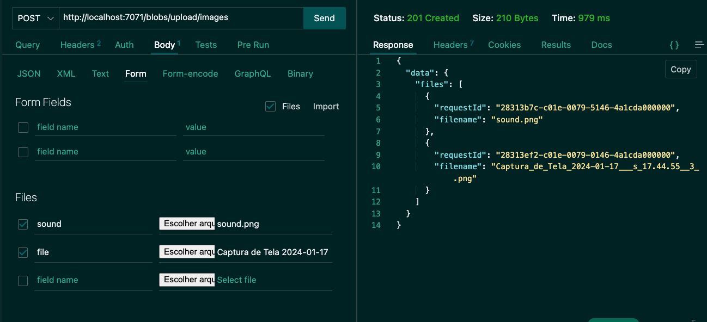
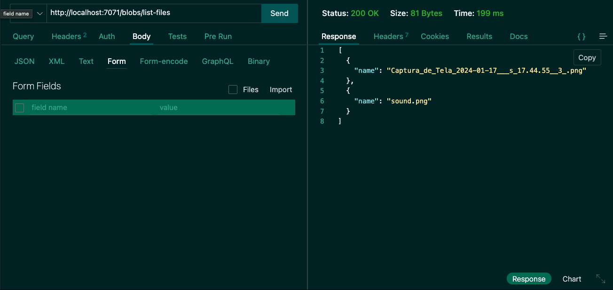

###  Azure Storage File System with Nest.js and Vite
--- 

🚧🚧🚧 Under Construction 🚧🚧🚧

### FRONTEND

##### Technologies

- React with Vite
- Axios
- React DropZone

##### Screenshots

---

# BACKEND

##### Technologies

- Nest.js
- Multer
- Azure Identity
- Azure Storage Blob

##### Screenshots

_POST /blobs/upload/images_

---

_GET /blobs/list-containers_

---

_GET /blobs/list-files_

