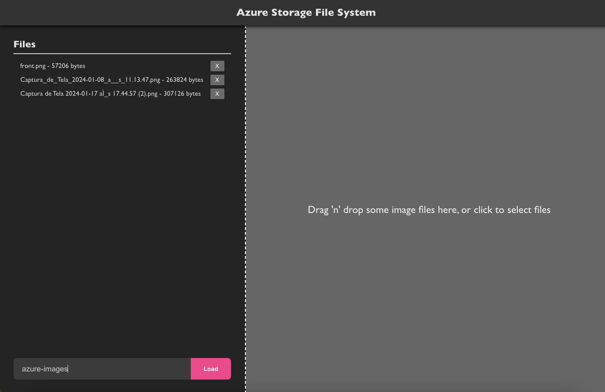

###  Azure Storage File System with Nest.js and Vite
--- 

🚧🚧🚧 Under Construction 🚧🚧🚧

### FRONTEND

#### Technologies

- React with Vite
- Axios
- React DropZone

#### Screenshots



---

# BACKEND

#### Technologies

- Nest.js
- Multer
- Azure Identity
- Azure Storage Blob

#### Endpoints
---

##### Upload Images
```http
POST http://localhost:7071/blobs/upload/test-azurite
Content-Type: multipart/form-data; boundary=boundary

--boundary
Content-Disposition: form-data; name="images"; filename="azure_blobs.png"
Content-Type: image/jpeg

< /yourpath/azure_blobs.png
--boundary--
```

---
##### List Files From Container

```http
GET http://localhost:7071/blobs/list-files/:containerName
```
---

##### List Containers
```http
GET http://localhost:7071/blobs/list-containers
```
---

##### Create Container
```http
POST http://localhost:7071/blobs/create-container
Content-Type: application/json

{
  "containerName": "test-azurite"
}
```

---

#### Screenshots

_POST /blobs/upload/images_


---

_GET /blobs/list-containers_


---

_GET /blobs/list-files_


---

_POST /blobs/create-container_


